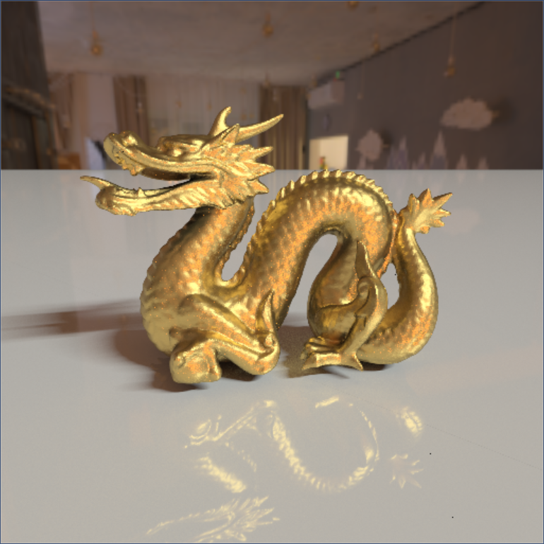
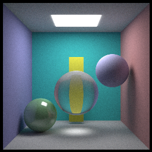
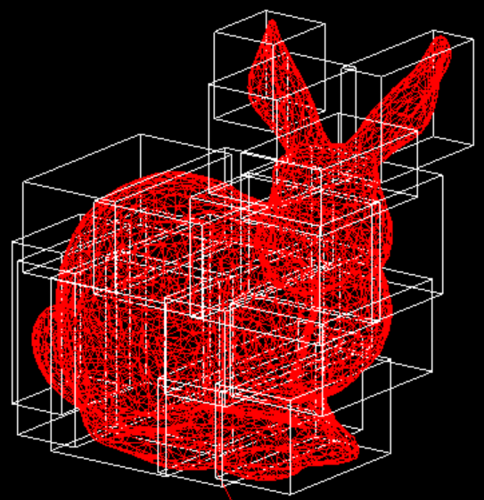
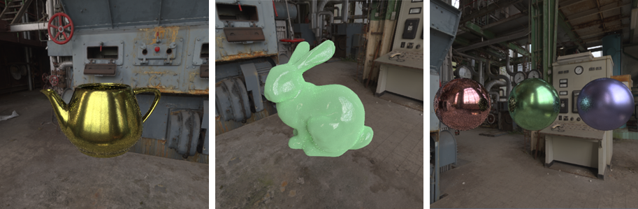
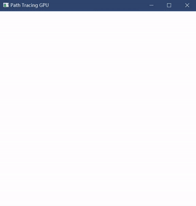
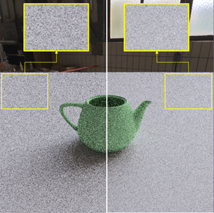
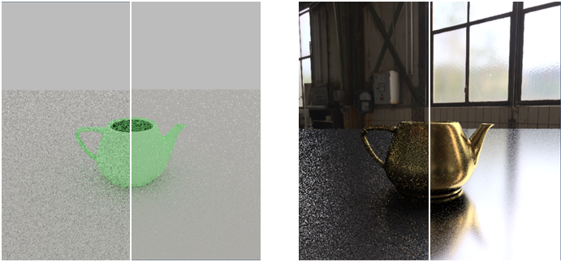
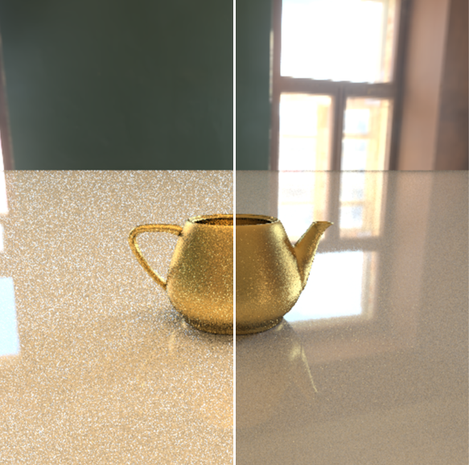

# ToyRenderer

ToyRenderer是一个简单的渲染器项目，使用C++实现了：

    1.whitted风格的基础光线追踪（basicRT）

    2.BVH构建与SAH优化光线跟踪(BVH)

    3.基于opengl环境的光线追踪（openglRT）

    4.disney风格的BRDF(Disney Principle BRDF）

    5.基于低差异序列与重要性采样的光线优化(LDS_ISS）

## part 1. whitted风格的基础光线追踪

    在这一部分中，使用C++与一个轻量的图形生成库svpng实现一个基本的光线跟踪程序，通过逐像素颜色计算并将每个像素作为结果输出到png图像中。

## part 2. 层次包围盒BVH与其优化方法

    在光线追踪算法中用BVH方法来做加速。同时使用SAH计算cost优化BVH。

## part 3. OpenGL ray tracing

    使用OpenGL的片段着色器运行加速程序。在纹理缓冲区中传输BVH和三角形，然后发送到着色器。最后逐步跟踪每个像素，然后在屏幕上显示动态跟踪过程。

## part 4. disney principle's BRDF

包括微平面理论，运用迪士尼原理的BRDF绘制各种物理材料。

## part 5. Importance Sampling & Low Discrepancy Sequence

去噪，加快拟合进度。

低差异序列（Sobol）：

 

重要性采样（Importance Sampling）、diffuse（左）和BRDF（右）：

HDR环境映射的重要性采样：

多重重要性采样：

